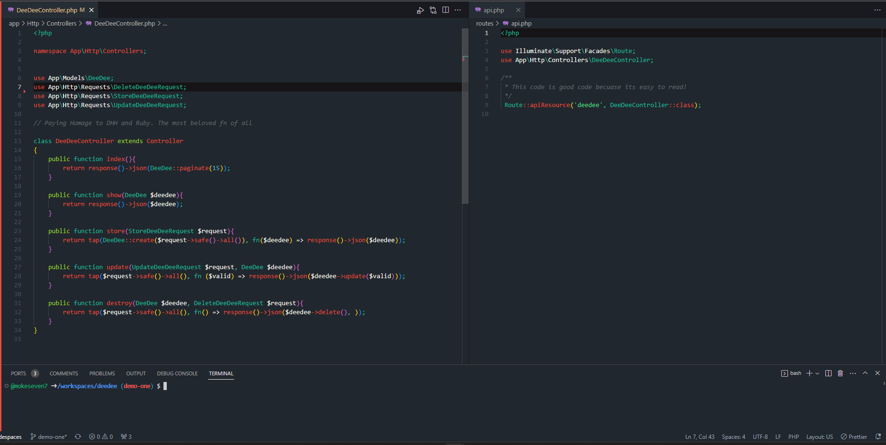
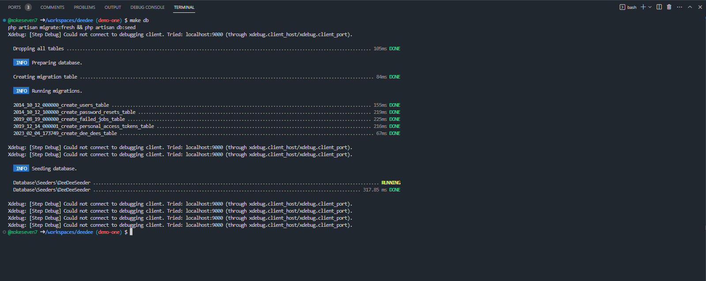
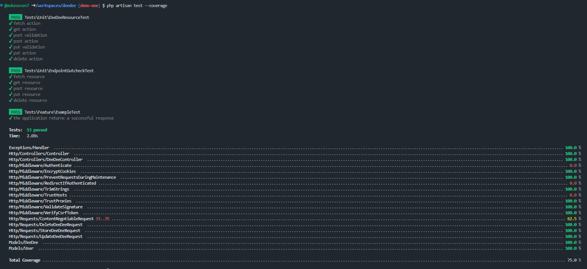
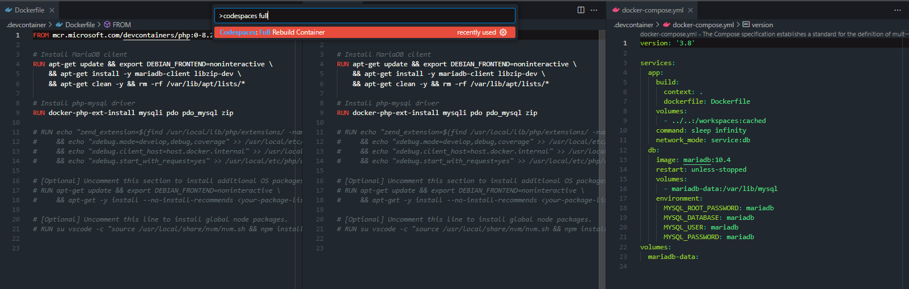

## How 2 CRUD 

This code is both boring and beutiful. People often forget the framework authors already did all the hard work. Alot of times the code that adheres the most closley to the opinions of the framework is the easiest to work on. 

## How 2 Be A Pal

We all love a good one liner. But when it comes to your teamates appriciating you, and encourging them to want to be better also. This is what matters more:

## Bro Code - 75% or better no matter what

## Bro code 2 - Make it easy for the homies

